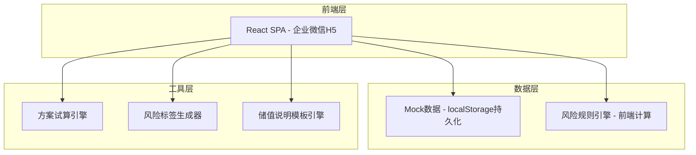
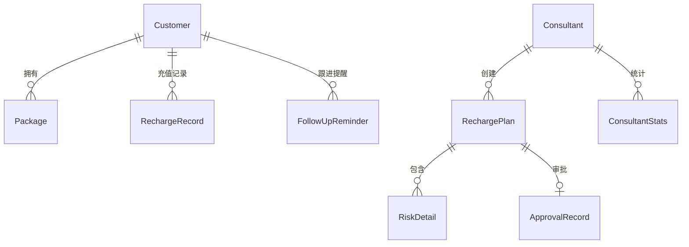

## 1. 架构设计



## 2. 技术说明

- **前端框架**：React@18 + TypeScript + Vite
- **样式方案**：Tailwind CSS@3 + CSS Variables 主题系统
- **路由方案**：React Router@6
- **图表库**：Recharts
- **图标库**：Lucide React
- **状态管理**：Zustand
- **初始化工具**：Vite
- **后端**：无(纯前端，Mock数据模拟)
- **数据库**：无(localStorage持久化Mock数据)

## 3. 路由定义

| 路由 | 用途 |
|------|------|
| / | 首页仪表盘，概览待办和风险统计 |
| /customer | 客户查询，手机号搜索和客户画像 |
| /plan | 方案试算，创建充值方案和实时风险检测 |
| /redline | 活动红线，规则看板和违规案例 |
| /approval | 主管审批，审批列表和详情 |
| /reminder | 跟进提醒，待跟进客户和提醒详情 |
| /trace | 话术留痕，储值说明生成和异常统计 |

## 4. API定义

无后端API，所有数据通过Mock服务提供。定义核心数据接口：

```typescript
interface Customer {
  id: string;
  phone: string;
  name: string;
  age: number;
  level: 'V1' | 'V2' | 'V3' | 'V4' | 'V5';
  unusedBalance: number;
  preferences: string[];
  packages: Package[];
  rechargeHistory: RechargeRecord[];
  riskTags: string[];
}

interface Package {
  id: string;
  name: string;
  amount: number;
  giftRatio: number;
  boundProjects: string[];
  expiryDate: string;
  remainingBalance: number;
  status: 'active' | 'expiring' | 'expired';
}

interface RechargeRecord {
  id: string;
  date: string;
  amount: number;
  giftAmount: number;
  packageId: string;
  consultantId: string;
}

interface RechargePlan {
  id: string;
  customerId: string;
  consultantId: string;
  amount: number;
  giftRatio: number;
  boundProjects: string[];
  validityPeriod: number;
  specialNotes: string;
  riskLevel: 'green' | 'yellow' | 'red';
  riskDetails: RiskDetail[];
  approvalStatus: 'none' | 'pending' | 'approved' | 'rejected';
  createdAt: string;
}

interface RiskDetail {
  type: string;
  level: 'green' | 'yellow' | 'red';
  message: string;
  rule: string;
}

interface ApprovalRecord {
  id: string;
  planId: string;
  consultantId: string;
  supervisorId: string;
  status: 'pending' | 'approved' | 'rejected';
  comment: string;
  createdAt: string;
  resolvedAt?: string;
}

interface FollowUpReminder {
  id: string;
  customerId: string;
  consultantId: string;
  type: 'old_card' | 'repurchase' | 'expiring';
  urgency: 'high' | 'medium' | 'low';
  message: string;
  suggestedScript: string;
  dueDate: string;
  completed: boolean;
}

interface ActivityRule {
  id: string;
  name: string;
  maxGiftRatio: number;
  maxAmount: number;
  validProjects: string[];
  startDate: string;
  endDate: string;
  description: string;
}

interface ViolationCase {
  id: string;
  type: string;
  description: string;
  consequence: string;
  anonymousDetail: string;
}

interface ConsultantStats {
  consultantId: string;
  consultantName: string;
  totalPlans: number;
  abnormalPlans: number;
  abnormalRate: number;
  trend: number[];
}
```

## 5. 服务器架构

无后端服务器，纯前端应用。

## 6. 数据模型

### 6.1 数据模型定义



### 6.2 数据定义语言

使用 TypeScript 接口定义（见上方API定义），Mock数据在 `src/data/mock.ts` 中初始化并存入 localStorage。
